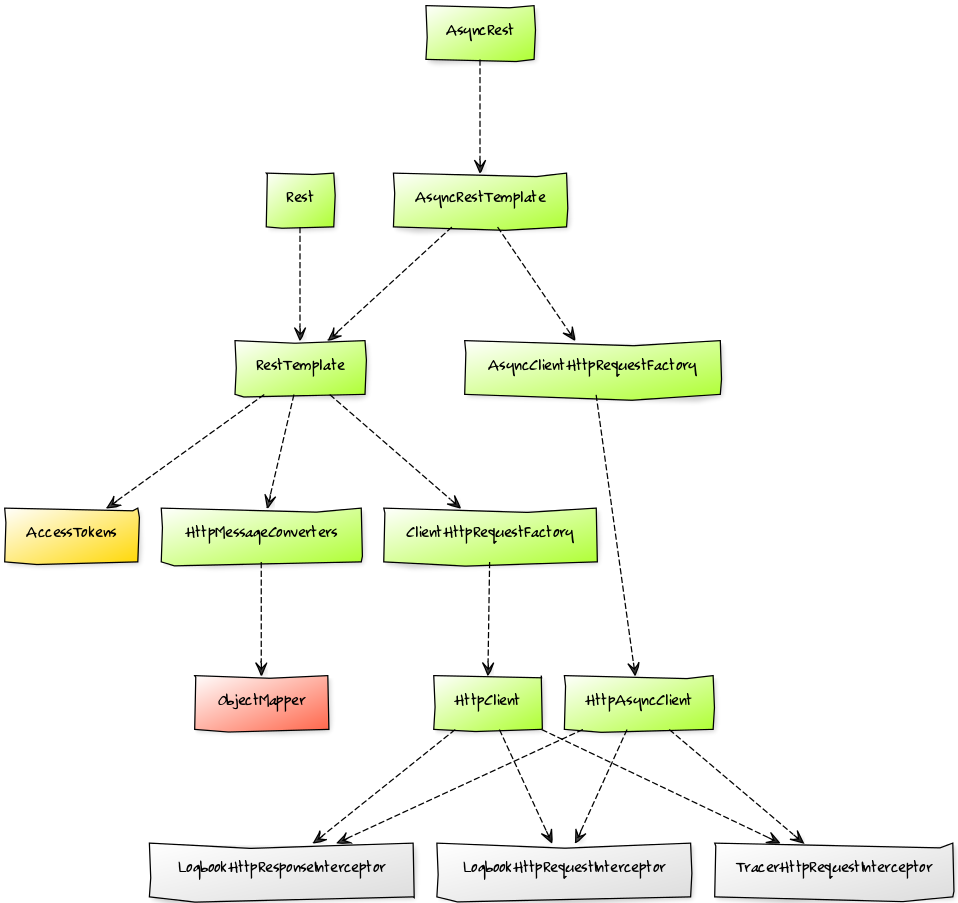

# Put it to REST!

[](https://pixabay.com/en/frog-meadow-relaxed-relaxation-fig-1109795/)

[](https://travis-ci.org/zalando-incubator/put-it-to-rest)
[](https://coveralls.io/r/zalando-incubator/put-it-to-rest)
[](https://github.com/zalando-incubator/put-it-to-rest/releases)
[](https://maven-badges.herokuapp.com/maven-central/org.zalando-incubator/put-it-to-rest)

Spring Boot REST client auto configuration

- **Technology stack**: Spring Boot
- **Status**:  Alpha

## Example

```yaml
rest.clients:
  example:
    base-url: http://example.com
    oauth.scopes:
      - example.read
```

```java
@Autowired
@Qualifier("example")
private Rest example;
```

## Features

- Seamless integration of:
  - [Riptide](https://github.com/zalando/riptide)
  - [Logbook](https://github.com/zalando/logbook)
  - [Tracer](https://github.com/zalando/tracer)
  - [Tokens](https://github.com/zalando-stups/tokens)
  - [STUPS Spring OAuth2 Client](https://github.com/zalando-stups/stups-spring-oauth2-support/tree/master/stups-spring-oauth2-client)
  - [Jackson 2](https://github.com/FasterXML/jackson)
- [Spring Boot](http://projects.spring.io/spring-boot/) Auto Configuration
- Sensible defaults

## Dependencies

- Java 8
- Any build tool using Maven Central, or direct download
- Spring Boot
- Apache HTTP Client

## Installation

Add the following dependency to your project:

```xml
<dependency>
    <groupId>org.zalando</groupId>
    <artifactId>put-it-to-rest</artifactId>
    <version>${put-it-to-rest.version}</version>
</dependency>
```

## Configuration

You can now define new REST clients and override default configuration in your `application.yml`:

```yaml
rest:
  oauth:
    access-token-url: https://auth.example.com
    scheduling-period: 10
    timeouts:
      connect: 1
      read: 2
  clients:
    example:
      base-url: https://example.com
      oauth:
        scopes:
          - uid
          - example.read
      timeouts:
        connect: 5
        read: 5
```

Clients are identified by a *Client ID*, for instance `example` in the sample above. You can have as many clients as you want.

For a complete overview of available properties, they type and default value please refer to the following table:

| Configuration                        | Type            | Default                                            |
|--------------------------------------|-----------------|----------------------------------------------------|
| `rest.oauth.access-token-url`        | `URI`           | required, can be overridden by `ACCESS_TOKEN_URL`  |
| `rest.oauth.scheduling-period`       | `int` (seconds) | `5`                                                |
| `rest.oauth.timeouts.connect`        | `int` (seconds) | `1`                                                |
| `rest.oauth.timeouts.read`           | `int` (seconds) | `2`                                                |
| `rest.clients.<id>.base-url`         | `URI`           | none                                               |
| `rest.clients.<id>.oauth`            |                 | none, disables OAuth2 security if omitted          |
| `rest.clients.<id>.oauth.scopes`     | `List<String>`  | none                                               |
| `rest.clients.<id>.timeouts.connect` | `int` (seconds) | `5`                                                |
| `rest.clients.<id>.timeouts.read`    | `int` (seconds) | `5`                                                |

## Usage

After configuring your clients, as shown in the last section, you can now easily inject them:

```java
@Autowired
@Qualifier("example")
private Rest example;
```

All beans that are created for each client use the *Client ID*, in this case `example`, as their qualifier.

Besides `Rest`, you can also alternatively inject any of the following types directly:
- `RestTemplate`
- `AsyncRest`
- `AsyncRestTemplate`

## Customization

For every client that is defined in your configuration the following graph of beans, indicated by the green color, will
be created:



Regarding the other colors:
- *yellow*: will be created once and then shared across different clients
- *red*: mandatory dependency
- *grey*: optional dependency

Every single bean in the graph can optionally be replaced by your own, custom version of it. Beans can only be
overridden by name, **not** by type. As an example, the following code would add XML support to the `example` client:

```java
@Bean
@Qualifier("example")
public HttpMessageConverters exampleHttpMessageConverters() {
    return new HttpMessageConverters(new Jaxb2RootElementHttpMessageConverter());
}
```

The following table shows all beans with their respective name (for the `example` client) and type:

| Bean Name                              | Bean Type                       | Configures by default      |
|----------------------------------------|---------------------------------|----------------------------|
| `accessToken` (no client prefix!)      | `AccessTokens`                  | OAuth settings             |
| `exampleHttpClient`                    | `HttpClient`                    | Interceptors               |
| `exampleClientHttpRequestFactory`      | `ClientHttpRequestFactory`      | Timeouts                   |
| `exampleHttpMessageConverters`         | `HttpMessageConverters`         | Text and JSON              |
| `exampleRestTemplate`                  | `RestTemplate`                  | Base URL and error handler |
| `exampleRestTemplate`                  | `StupsOAuth2RestTemplate`       | Base URL and error handler |
| `exampleRest`                          | `Rest`                          |                            |
| `exampleHttpAsyncClient`               | `HttpAsyncClient`               | Interceptors               |
| `exampleAsyncClientHttpRequestFactory` | `AsyncClientHttpRequestFactory` | Timeouts                   |
| `exampleAsyncRestTemplate`             | `AsyncRestTemplate`             |                            |
| `exampleAsyncRest`                     | `AsyncRest`                     |                            |

If you override a bean then all of its dependencies (see the [graph](#customization)), will **not** be registered,
unless required by some other bean.

## Getting Help

If you have questions, concerns, bug reports, etc., please file an issue in this repository's
[Issue Tracker](issues).

## Getting Involved/Contributing

To contribute, simply make a pull request and add a brief description (1-2 sentences) of your addition or change. For
more details, check the [contribution guidelines](CONTRIBUTING.md).